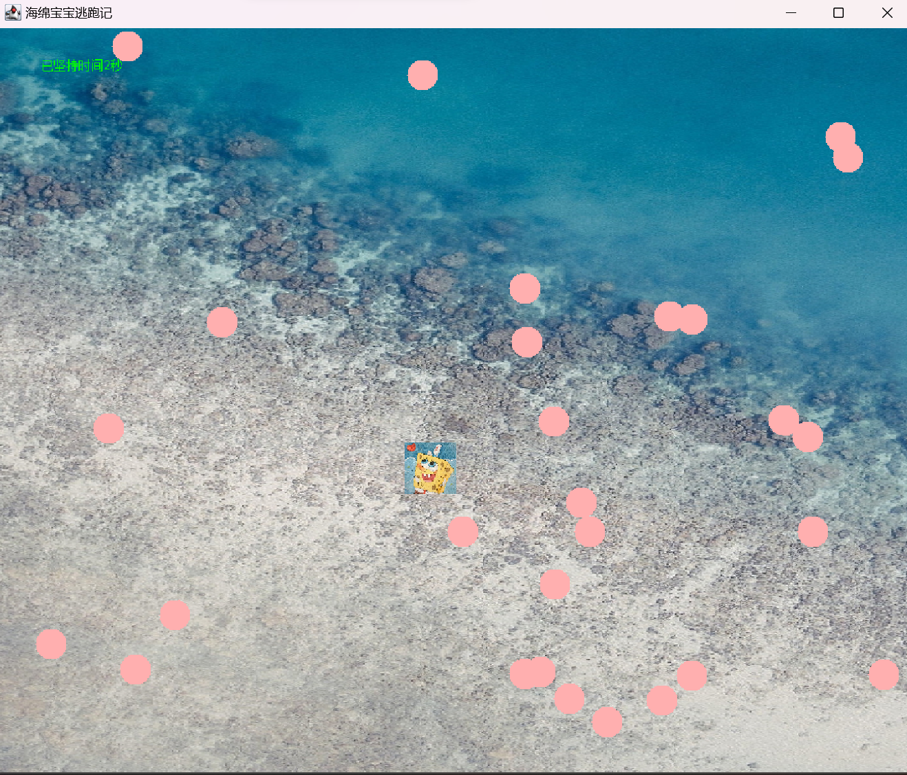
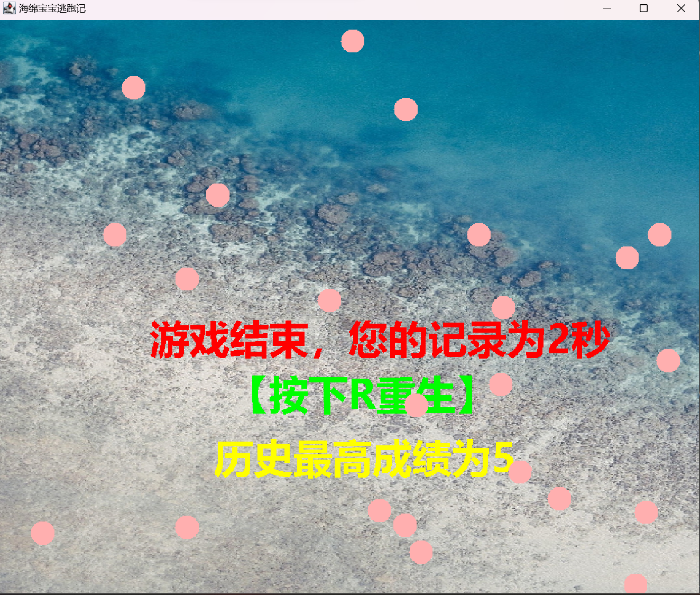

# 游戏效果展示

## 游戏整体思路

基于物体坐标的移动和坐标范围碰撞思路，在控制矩形范围固定的小海绵宝宝在屏幕上移动，从屏幕中心生成n个小球，小球按照设定的规律往四周进行移动，然后我们可以控制海绵宝宝移动，一旦碰撞到小球，游戏就结束，通过一个计时器，最后把存活的时间显示在屏幕上。

### 游戏大体分为以下几个类：

- **Content**：存放变量的存放区
- **Explode**：爆炸类
- **GameObject**：游戏物品类
- **GameUtil**：游戏工具类
- **MyGameFrame**：游戏主窗口框架初始化类
- **Plane**：海绵宝宝参数类
- **Shell**：炮弹类

### MyGameFrame类

1. 通过GameUtil中写的getImage函数先后载入图片 海绵宝宝 和 背景
2. 初始化一个飞机(海绵宝宝) ， 坐标为：x=800，y=800，速度为3，高度为50，宽度为50
3. 初始化炮弹数组，并通过Shell中的静态变量炮弹数量给定数组大小
4. 初始化爆炸对象，并且通过Data类建立一个计时器记录时间
5. 重写paint方法，传入Graphics参数画笔p，测试一下画笔是否可用
6. 通过画笔绘制背景图片，并调用时间判断函数drawTime（）
7. 通过plane类中重写的drawMyself方法绘制飞机(海绵宝宝)
8. 通过循环把每个炮弹都初始化，并给碰撞赋值，实时判断是否发生碰撞，一旦peng（碰撞）为真，我们就把plane（海绵宝宝）中的live（存活）改成false（死亡），并绘制爆炸效果
9. drawTime函数来控制plane（海绵宝宝）实时存活与否，通过System.current.TimeMills函数获取当前时间，减去刚开始时记录的时间pstart，由于时间是毫秒，故除以1000得到秒数，若爆炸已发生，时间定格，并且输出记录在屏幕上，在末尾加上一个判断，如果当前存活时间大于最大存活时间（用Content变量类中的静态变量MuZiMax记录），如果按下R重生，那就把参数全部还原
10. 创建游戏窗口初始化函数CreatFrame，通过set title设置标题，使窗口可视化，设置窗口大小和初始化的坐标，新增窗口监听关闭功能，启动重画窗口线程，开启键盘监听，并初始化炮弹。
11. 生成内部类PaintThread（重画窗口进程），使用线程使得窗口自动反复绘制，类中重写run方法并设定绘制间隔，也就是一秒钟绘制图片的数量（帧）
12. 定义键盘监听类，重写键盘按压方法，方法中调用plane类中控制重生的方法Relive和移动的方法。重写键盘松开方法，方法中调用plane类中按钮释放的方法
13. 通过双缓冲技术使屏幕防止屏幕闪烁，有时候RePaint调用Paint绘图时，由于update每次调用之前会有一个清屏，我们可以重写update来避免闪烁
14. 在main中实例化游戏视图框架

### Content类

用于存放一些全局变量和数据
1. 建立Count，窗口绘制的次数，每次绘制窗口的时候数值+1
2. 建立GAMEWIDTH和GAMEHIGH来控制可视化窗口的大小，这里设置成了900
3. 建立变量MuZiMax以记录最大的生存分数，在游戏结束时进行打印

### Explode类

用于对爆炸效果的播放进行配置
1. 首先要有爆炸效果发生的坐标x，y，定义为double类型，还有一个爆炸计数器，用于判断爆炸图片运行的次数
2. Image是表示图形图像的所有类的超类，多用于操作图片，我们实例化一个image数组，16张图片，故数组大小16，接下来用一个static把这块代码静态化，以后不用更改，用一个for循环初始化数组，并且在对应路径放入图片，并通过GetWidth加载图片类
3. 由drawMyself函数，执行16次，每次通过drawImage在x，y坐标上绘制出图片数组，以达到爆炸效果的显示
4. 分别编写无参构造器和有参（传入坐标x，y），并给x，y赋值
5. 最后这里我还测试了，在main函数中是否能正常打印BufferedImage@6fdb1f78: type = 6 ColorModel: #pixelBits = 32 numComponents = 4 color space = java.awt.color.ICC_ColorSpace@12bc6874 transparency = 3 has alpha = true isAlphaPre = false ByteInterleavedRaster: width = 60 height = 60 #numDataElements 4 dataOff[0] = 3 Process finished with exit code 0 可以正常输出打印

### GameObject类

是指游戏物体类，是海绵宝宝和炮弹（两个物体）的父类
1. 物体图片image
2. 物体坐标 x，y
3. 物体速度speed
4. 物体大小 width，high
5. 通过有参构造器对物体进行初始化，别忘记无参构造器，避免后续的类无法继承
6. 编写drawMyself函数 调用画笔的drawImage将物体绘制出来
7. 编写geterct（）检测区域和碰撞（由于物体都是矩形）

### GameUtil类

游戏工具类实现创建图片阅读器，后续添加各种其他工具也可在此类生成
1. 通过BufferedImage建立图片返回指针，BufferedImage是一个内存对象，当通过ImageIO.read()方法读取一个图像文件时，读取到的关于图像文件的所有信息都会被存储在该API返回的BufferedImage内存对象中
2. 再创建Url完成关键图片资源管理器的调用
3. 利用 try catch避免抛出异常，也就是创建失败，读取失败
4. 阅读成功以后返回刚开始建立的图片指针

### Plane类

该类继承了游戏物品类，用于表示图片中我们所需要控制的物体，代表（海绵宝宝）
1. 先建立上下左右和是否重生relive和live六个boolean类型，初始化relive为flase，没有重生，初始化live为true，表示海绵宝宝活着
2. 重写父类中的绘制自身的方法drawMyself，首先我们要判断海绵宝宝是否死亡，倘若没有死亡，我们先把图片绘制出来，并通过四个if语句分别在四个方向上进行判断，任意一个方向的boolean值为ture时，我们让海绵宝宝的x，y坐标分别随之增减speed，以完成海绵宝宝的移动
3. 通过传入的keyEvent先测试出键盘上A,W,S,D,R的对应的Code（通过打印e.getCode），分别是87，83，65，68，82，由四个if函数分别写出按钮按压和按钮释放时，上下左右boolean值的变化，按压时为ture，释放时为false，对于重生relive，在按压R键时候，使其boolean变为true
4. 最后建立构造器，传入，图片，坐标，大小，以及速度

### Shell类

该类是炮弹类也是继承了游戏物品类，新增炮弹自身数量以及炮弹移动路径，在窗口中绘制并且按照算法进行有规律的移动
1. 定义炮弹数量dans和炮弹自己的角度degree
2. 通过无参构造器，对炮弹进行初始化，每个炮弹的其他参数，大小，速度，宽高都是默认一样的，但是炮弹的角度，通过随机函数Math.random()Math.PI2来随机生成
3. 一样的，通过重写父类绘制自身函数drawMyself把炮弹进行绘制出来，这里就不需要加载炮弹的图片了，我们把炮弹以画笔直接绘制出实心圆g.fillOval，并且给画笔设置颜色g.setcolor(),这里我们设置成为粉色,通过Math.cos(),和Math.sin()函数传入角度,使炮弹沿着不同的角度发射
4. 最后增加2个判断,当炮弹碰到窗口坐标的边缘时,以相反的角度返回,竖直方向反弹,degree变为-drgree,水平方向反弹直接用PI减去原本的角度.
